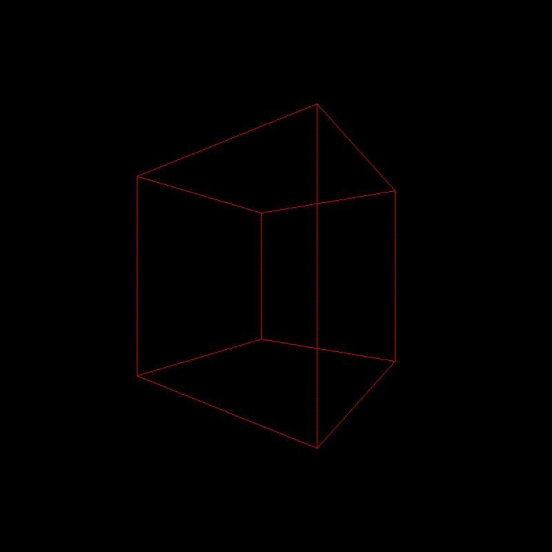

# Spinning cube

It's a spinning cube.

## Installation

### Dependencies
- [SDL2](https://github.com/libsdl-org/SDL/releases/latest)

And of course a C compiler

### Setup

```bash
git clone https://github.com/bitt4/spinning-cube
cd spinning-cube
make
./spinning_cube
```

## Demo


